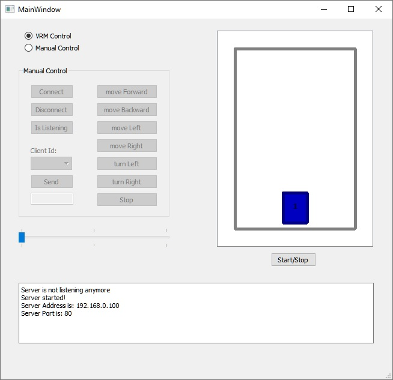

# VRM-Server
VRM-Server gets signals from VRM-Clients, builds road map and controls situation on the map 

The project is written with QT Creator 4 on Qt 5

The program works together with VRM-Client

Multiple clients can be connected to the Server

Server gets signals from Clients, builds a map according to these signals, analyses the situation and sends signals back to Clients according to the state

Firstly the Server should be started which awaits connections from Clients

In manual mode a chosen client can be controlled independently

In VRM mode all the clients are shown on the Virtual Road Map according to the real state, the supervisor controls a situation on the road and sends signals to clients like stop\continue motion, turn left\right and so on

Video:
https://youtu.be/fpxNOpHT_lg

Images:

